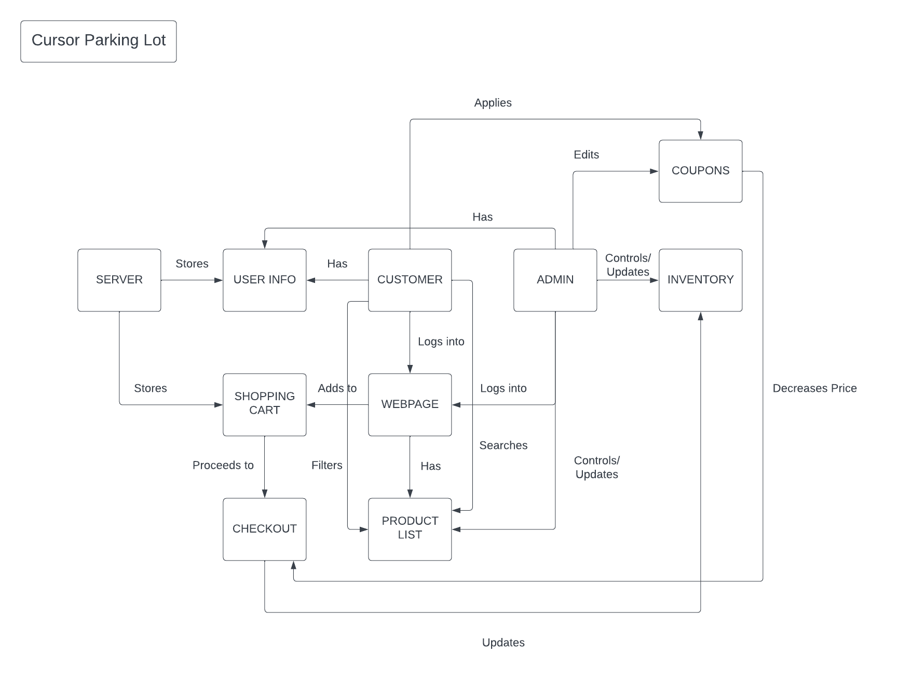

# PROJECT Design Documentation

## Team Information
* Team name: name
* Team members
  * Finn Saunders
  * Justin Lin
  * Tashi Tseten
  * PJ Esterly

## Executive Summary
This is a summary of the project.

This project is an e-store application with minimal functionality, security, and presistance.

### Purpose
The project is an e-store application that will allow the customer(s) to shop for certain sports balls with the goal of having an easy shopping expereince and the ability to log out and login without their data disappearing.

### Glossary and Acronyms
| Term | Definition                        |
|------|-----------------------------------|
| SPA  | Single Page                       |
| DAO  | Data Access Object                |
| API  | Application Programming Interface |
| HTML | Hypertext Markup Language         |
| cURL | Client URL                        |
| CRUD | Create, Read, Update, and Delete  |
| MVP  | Minimum Viable Product            |

## Requirements
This section describes the features of the application.

-Login Page
-Unique Admin and User Pages
-Inventory Control
-Product Search
-Product Management
-Shopping Cart

### Definition of MVP

The MVP will have the following functionality: minimal authentucation for users (owner and custmoer and only usernames), customer functionality including viewing products, a shopping cart, and a checkout, inventory management, and data persistance.

### MVP Features
-Inventory
  -Add
  -Remove
  -Modify
-Login
  -Owner view
  -Customer veiw
  -Username
-Shopping Cart
  -Add
  -Remove
  -Checkout
-Browse
  -View products
  -Search products

### Roadmap of Enhancements
-Inventory Management
-Browse
-Login
-Shopping Cart
-10% Filtering and Sorting
-10% Discount Codes

## Application Domain

This section describes the application domain.

The domain for this application consists of the user, owner, inventory, product browsablilty, and login function as the large features for this application. The domain model helps to illustrate how these features interact with each other and includes some smaller sub-features and how they interact with each other and the large features.

## Architecture and Design

This section describes the application architecture.

### Summary

The following Tiers/Layers model shows a high-level view of the webapp's architecture.

The e-store web application, is built using the Model–View–ViewModel (MVVM) architecture pattern. 

The Model stores the application data objects including any functionality to provide persistance. 

The View is the client-side SPA built with Angular utilizing HTML, CSS and TypeScript. The ViewModel provides RESTful APIs to the client (View) as well as any logic required to manipulate the data objects from the Model.

Both the ViewModel and Model are built using Java and Spring Framework. Details of the components within these tiers are supplied below.

### Overview of User Interface

This section describes the web interface flow; this is how the user views and interacts
with the e-store application.

The website boots to the home page/ dashboard page. Within this page the user can search for products and see "recommended" products. From here the user can see and use a navigation bar at the top of the website. The options are login, dashboard, products, and shopping cart.

The login page allows a user to login to their current account or register a new account by typing in a new username.

The shopping cart page allows a user to see and make changes to their shopping cart. This means that a user can add or remove things from their shopping cart. After the user is ready to checkout they can click the checkout button which brings them to a new page within the shopping cart page that allows them to review their order and apply any discount codes they would like.

Lastly, the products page is a page that contains all of the store's products in a list grid format. The user can click on each individual product to see its details and and add that product to the cart.

### View Tier

The View Tier is the website, run through Angular. It's split into 9 different page components, each with an html, css, and typescript file. There is also a component for messages, which the user is not able to see unless enabled. The html and css handle what the user can see, with the typescript for each page running the logic. The page typescript also communicates with the typescript services in the ViewModel Tier. The user loads the website, views the html page and can navigate around to different pages and interact with items on the page, including the MVP and 10% feautres.

### ViewModel Tier

The ViewModel tier is also made in Angular and typescript. It takes the form of service files, which contain methods to call the cURL methods present in the Model Tier. It is the bridge between the Model and View Tiers, and communicates data and user descisions between them.

### Model Tier

The Model Tier architecture uses the Spring REST API to run a server. The code is split into 3 sections, model, controller, and persistence. The model section is filled with Java classes for the kinds of objects we use in the project, Discounts, Products, Shopping Carts, and Users. The controller sections is made up of classes that handle the cURL calls to the API. There is a controller for each Model. There is also a controller to see which user is logged in. The persistence section has 2 Java classes for each model, a DAO interface and a FileDAO class. These contain the methods for accessing and editing the data for the project. The data for this project is split into 3 JSON files, codes.json (discount codes), products.json(products), and users.json(users and their shopping carts). 

### Static Code Analysis/Design Improvements

Some imporvements that could be made would mostly include improvements regarding quality of life improvements. These would be things such as being able to add a specified number of one product instead of having to click 'add to shopping cart multiple times.

After the static code analysis was run the first time (sprint 2), we ended up with 3 bugs. These bugs were fixed during sprint 3 and we currently have 4 bugs. We sadly did not have time to fix these bugs but they do not seem to be fatal.

## Testing

The testing for sprint 1 consisted of testing our product classes and the code that is associated with product objects (mostly cURL command functions). During our testing for sprint 1, everything but our create (the PUT cURL command) passed our suite of tests. The create function only failed the test that checked if a product already existed. This was a quick fix.

The testing for sprint 2 consisted of testing the remaining code for the MVP of the project. This included testing for our login, user, and shopping cart code. During the testing for sprint 2, all of our tests ran successfully and all tests passed for the first run.

The testing for sprint 3 consisted of testing for our 10% features. Our two 10% features were a discount code system and a product filtering and sorting system. We only needed to write tests for our discount system as our product filtering and sorting system was only written using typescript and no java. During our testing for sprint 3, all of our tests ran successfully and all tests passed for the first run.

### Acceptance Testing

We did not do any acceptance testing for sprint 1 and only did JUnit tests.

The testing for sprint 2 included the user stories and accpetance testing for the developement completed in sprint 2 and sprint 1. This resulted in acceptance testing for 16 user stories. After the first round of testing was completed, we only had one test fail. This test was the test that checked for trying to create a product when a product with the specified ID already exists. This test was quickly fixed and resulted in a flawless suite of tests for sprint 2.

The testing for sprint 3 included the rest of the developemental user stories and the previous developmental user stories for sptrints 1 and 2. This means that we are testing for 23 user stories. After the first round of testing we suprisingly passed all tests without fail.

### Unit Testing and Code Coverage

Our unit testing strategy is based off of the unit testing strategy that was used for the Heros example. In short, our unit tests are written with the goal to cover as much code as possible and test for all possibilities (i.e., successful and non-successful creations of a product).

The team's code coverage goal is inline with the project's code coverage goal of 90%. We decided to use this number as it is the recommended code coverage percent by our professor.

Our code coverage for sprint 2 resulted in having 84% of our code being tested. Although this is less than our goal, it is the highest number that we could achieve with our tests. No anomalies were found.

Our code coverage for sprint 3 resulted in having 84% of our code being tested. Although this is less than our goal, it is the highest number that we could achieve with our tests. No anomalies were found.